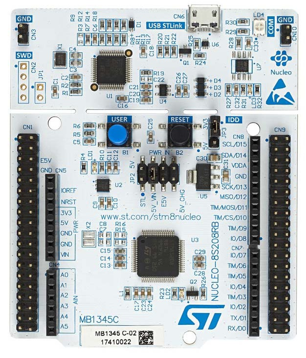
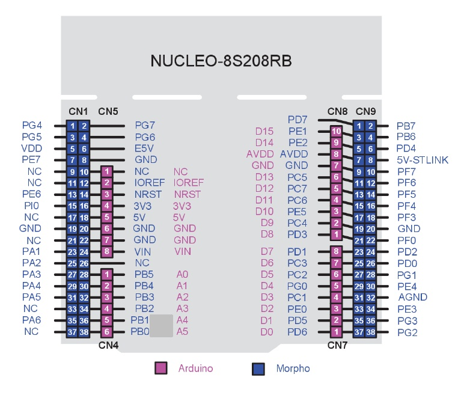
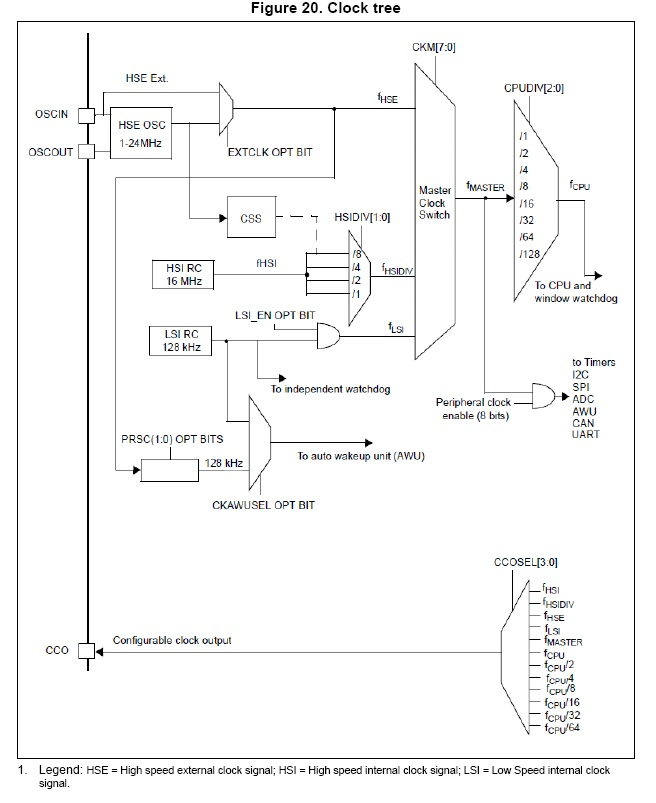

<h1 align="center">
Důležité informace k STM8

</h1>

- [Základní informace](#Informace)
- [Napájení](#nap%C3%A1jen%C3%AD)
- [Konektory](#konektory-a-piny)
- [GPIO](#GPIO)
  - [GPIO Inicializace](#GPIO-Incializace)
    - [výstupní](#v%C3%BDstupn%C3%AD)
    - [vstupní](#vstupn%C3%AD)
  - [LED](#led)
  - [Tlačítko](#tla%C4%8D%C3%ADtko)
  - [Multitasking](#multitasking) -[Knihovny](#knihovny)

## Důležité URL

- <a href="https://www.st.com/resource/en/datasheet/stm8s208rb.pdf" alt="datasheet"><b>Datasheet</b></a>
- <a href="https://github.com/peoblouk/STM8.git" alt="git clone"><b>Git clone</b></a>

## Informace

- vývojový kit `NUCLEO-8S208RB` se skládá ze dvou částí: programátoru/debuggeru zvaného ST-link V2/1 a desky s cílovým mikrokontrolérem napájení
- část desky s cílovým mikrokontrolérem obsahuje stabilizátory napětí `5V a 3.3V`, jumpery pro volbu napájecího napětí, uživatelské tlačítko (modré), reset tlačítko a postranní konektory

## Napájení

- Modul lze napájet ze čtyř zdrojů, které se přepínají pozicí jumperu JP2. Jumper na pozici označené:

- `STL` - napájí modul 5V napětím z USB přes elektronický spínač ovládaný ST-linkem, ST-link si po připojení USB konektoru do PC zažádá o rezervaci proudu 300mA

  - pokud mu tento požadavek PC schválí (což typicky udělá), tak otevře elektronický spínač a pustí 5V napájení do vývojového kitu
  - ten pak může napájet další zařízení se spotřebou do 300mA (jako třeba různé displeje atd.)
  - elektroniký spínač obsahuje i proudový limit přibližně 0.65A, který poskytuje dodatečnou ochranu USB portu, je to tedy vhodné řešení pro začátek
  - úroveň 5V není přesná ani stabilní a může kolísat +-5%

- `5V_CHG` - napájí modul 5V napětím z USB přímo. Maximální povolená spotřeba je pak 100mA. Úroveň 5V není přesná ani stabilní a může kolísat +-5%

- `E5V` - v této konfiguraci napájíte modul (s cílovým mikrokontrolérem) externím zdrojem napětí 5V připojeným na piny označené E5V a GND

  - tato konfigurace umožňuje napájet modul i jiným než 5V napětím, můžete použít třeba 3V nebo napájet přímo akumulátory (lithiové se pohybují mezi 3V-4.2V)
  - je třeba dodržet maximální napájecí napětí mikrokontroléru 5.5V, v případě, že máte připojené další obvody, je potřeba dbát i na jejich maximální provozní napětí
  - stačí jedna chyba a můžete všechno usmažit

- `5V_VIN` - v této konfiguraci modul napájíte výstupem vestavěného 5V stabilizátoru

  - zdroj napájení připojujete na piny VIN a GND. Napájecí napětí smí být v rozsahu 7-12V a maximální spotřeba je limitovaná maximálním ztrátovým výkonem stabilizátoru (~1.7W)
  - nesmí tedy nikdy překročit jednak limit 800mA a taky výkon 1.7/(VIN-5V)
  - například při napájení 9V je maximální povolená spotřeba přibližně 450mA, tato konfigurace je vhodná při napájení například z 12V adaptéru nebo 9V baterie

## Konektory a piny

### GPIO

- zkratkou GPIO (General Purpose Input Output) se označují vstupy/výstupy či též "vývody" nebo "piny" mikrokontroléru
- tyto vstupy a výstupy jsou tím nejdůležitějším co musíte při práci s mikrokontrolérem ovládat
- skrze GPIO může mikrokontrolér vnímat a ovládat okolní svět

- STM8 má porty `GPIOA, GPIOB, GPIOC, GPIOD, GPIOE, GPIOF, GPIOG a GPIOI`. Jednotlivé vývody v portu se označují číslem mezi `0 a 7`

### GPIO Incializace

- funkce která konfiguruje vybraný pin, prvním argumentem je port, druhým je pin, třetím argumentem je jeho konfigurace `GPIO_Init()` s argumenty:

- první argument:

  - `GPIOA, GPIOB, GPIOC, GPIOD, GPIOE, GPIOF, GPIOG nebo GPIOI`

- druhý argument:

  - `GPIO_PIN_0 až GPIO_PIN_7` (je třeba znát které piny použít)
  - `GPIO_PIN_LNIB` - Low nibble pins selected
  - `GPIO_PIN_HNIB` - High nibble pins selected
  - `GPIO_PIN_ALL` - All pins selected

- třetí argument:

  #### výstupní

  - `GPIO_MODE_OUT_OD_LOW_FAST` - Output open-drain, low level, 10MHz
  - `GPIO_MODE_OUT_PP_LOW_FAST` - Output push-pull, low level, 10MHz
  - `GPIO_MODE_OUT_OD_LOW_SLOW` - Output open-drain, low level, 2MHz
  - `GPIO_MODE_OUT_PP_LOW_SLOW` - Output push-pull, low level, 2MHz
  - `GPIO_MODE_OUT_OD_HIZ_FAST` - Output open-drain, high-impedance level,10MHz
  - `GPIO_MODE_OUT_PP_HIGH_FAST` - Output push-pull, high level, 10MHz
  - `GPIO_MODE_OUT_OD_HIZ_SLOW` - Output open-drain, high-impedance level, 2MHz
  - `GPIO_MODE_OUT_PP_HIGH_SLOW` - Output push-pull, high level, 2MHz

  #### vstupní:

  - `GPIO_MODE_IN_FL_NO_IT` - Input floating, no external interrupt
  - `GPIO_MODE_IN_PU_NO_IT` - Input pull-up, no external interrupt
  - `GPIO_MODE_IN_FL_IT`- Input floating, external interrupt
  - `GPIO_MODE_IN_PU_IT` - Input pull-up, external interrupt

- příklad inizializace LED: `GPIO_Init(GPIOB, GPIO_PIN_0, GPIO_MODE_OUT_PP_HIGH_SLOW);`

### LED

- mastavování logické úrovně `"High"` a `"Low"` provádíme funkcemi `GPIO_WriteHigh` a `GPIO_WriteLow`

- `GPIO_WriteHigh` - nastaví na zvoleném pinu (nebo skupině pinů) úroveň High (log.1). Prvním argumentem je port (GPIOA až GPIOI), druhým argumentem je pin (nebo jejich skupina). Piny se zapisují v podobě GPIO_PIN_0 až GPIO_PIN_7 (což jsou předem připravená makra v knihovnách). Chceme-li nastavit více pinů zároveň (na stejném portu) zapisujeme je za sebe oddělené znakem ' | ' (logický OR). Například takto GPIO_PIN_1 | GPIO_PIN_2
- `GPIO_WriteLow` - nastaví na zvoleném pinu (nebo skupině pinů) úroveň Low (log.0). Stejně jako u předchozí funkce je prvním argumentem port (GPIOA až GPIOI) a druhým argumentem je pin (nebo skupina pinů)

- `GPIO_Write` - pošle data na port (různé formáty: 0b00000000 - 0b11111111, 0D - 128D, 0H - FH, atd.)

### Tlačítko

- na našem kitu máme modré tlačítko označené B1, které je připojené na pin `PE4`
- na pin mikrokontroléru nesmíme přivést napětí větší jak napájecí
- na pin mikrokontroléru nesmíme přivádět záporné napětí
- stav vstupu čteme funkcí `GPIO_ReadInputPin`
- napětí menší jak `30%` napájecího napětí čte mikrokontrolér jako úroveň `Low` (log.0)
- napětí větší jak `70%` napájecího napětí čte mikrokontrolér jako úroveň `High` (log.1)
- napětí mezi `30%` a `70%` napájecího mikrokontrolér může přečíst jako úrveň `Low i High`
- Pull up

  - vnitřní pullup rezistor má odpor přibližně `50kOhm`
  - vstup se zapnutým vnitřním pullup rezistorem se konfiguruje funkcí GPIO_Init s volbou `GPIO_MODE_IN_PU_NO_IT`
  - vnitřní pullup rezistory lze mimo jiné využít pro jednoduché připojení tlačítek, spínačů a přepínačů k mikrokontroléru

- Open Drain

  - výstup typu `Open-Drain` se v úrovni Low chová stejně jako výstup typu Push-Pull, tedy jako měkký zdroj 0V.
  - výstup typu `Open-Drain` se v úrovni High chová jako "Vysoká impedance" - tedy jako vstup.
  - výstupy typu `Open-Drain` se smí spojovat dohromady a potřebují vnější pullup rezistor

- příklad inizializace tlačítka: `GPIO_Init(GPIOE, GPIO_PIN_4, GPIO_MODE_IN_FL_NO_IT);`

### PWM modulace

-

### Clock

- `HSE OSC` - krystalový oscilátor (kterému ale chybí krystal a kondenzátory). Ten je možné připojit k pinům OSCIN (PA1) a OSCOUT (PA2). Krystal smí mít rezonanční frekvenci mezi 1 až `24MHz`, při 24MHz bude náš mikrokontrolér schopen provádět přibližně 20 milionů instrukcí za sekundu (tzv 20MIPS), další funkci kterou HSE OSC zvládá je zpracování externího clocku, místo oscilátorů můžeme na pin OSCIN přivést připravený obdélníkový průběh o libovolném kmitočtu do 24MHz a použít ho jako clock, kterou z těchto variant bude HSE provádět rozhodneme pomocí "option byte" programátorem

- `HSI RC` - 16MHz je vnitřní RC oscilátor o frekvenci `16MHz`, není přesný (jak si sami ověříte), ale nepotřebuje ke své činnosti žádné vnější součástky a tím zjednodušuje zapojení mikrokontroléru, signál z něj vede do multiplexeru označeného `HSIDIV`, který umožňuje podělit tento signál na kmitočty `16MHz,8MHz, 4MHz a 2MHz`

- `LSI RC 128kHz` je vnitřní RC oscilátor o frekvenci `128kHz`, který slouží k provozu watchdogu a vybraných periferií. Je s ním možné taktovat mikrokontrolér ale uplatnění najde v nízkopříkonových aplikacích (low power) a ty teď ponecháme stranou

- `Master Clock Switch` - přesně to co se na něm píše. Multiplexer který vybírá jeden z výše zmíněných zdrojů clocku pro celý zbytek mikrokontroléru (tedy pro jádro a většinu periferií)

- `CPUDIV` - opět multiplexer který umožňuje snížit taktovací frekvenci jádru. To je funkce opět určená ke snižování spotřeby a my se s ní nebudeme zabývat a vždy budeme udržovat dělící poměr `"/1"`

  - `CLK_PRESCALER_HSIDIV1` - nastaví frekvenci 16MHz
  - `CLK_PRESCALER_HSIDIV2` - nastaví frekvenci 8MHz
  - `CLK_PRESCALER_HSIDIV4` - nastaví frekvenci 4MHz
  - `CLK_PRESCALER_HSIDIV8` - nastaví frekvenci 2MHz (s touto konfigurací se mikrokontrolér startuje

- `CCOSEL` - a výstup CCO slouží k "vyvedení" clocku na pin a bude o něm řeč později.

- pro většinu naší práce si z tohoto "komplikovaného" schematu vystačíme s možností volit clock mezi HSI a HSE, tam kde nebudeme potřebovat přesnou frekvenci budeme používat HSI a tam kde budeme potřebovat přesnější frekvence (u aplikací kde pracujeme s časem) sáhneme po `HSE`

### Multitasking

- Milis
  - jedna hojně rozšířená technika (cooperative multitasking) využívá běžícího časovače, který počítá milisekundy od startu mikrokontroléru
  - váš program si může čas kdykoli zjistit a využívá toho aby plánoval kdy se má která úloha vykonat
  - funkci milis jsem pro vás připravil a o tom jak je vytvořená se pobavíme někdy později
  - init_milis(), ta spustí časovač TIM4 kerý každou milisekundu volá přerušení a inkrementuje počítadlo času (16bit proměnnou nesoucí informaci o počtu milisekund)
  - funkce milis() vám pak vrátí vždy aktuální hodnotu tohoto "počítadla"
  - jak brzy uvidíte, bude to velmi užitečný pomocník

### Knihovny

- <a href="http://elektromys.eu/knihovny.php" alt="git clone"><b>Elektromys.eu</b></a>
- <a href="https://www.hodges.org/rh/stm8/libs/index.html" alt="git clone"><b>Hodges.org</b></a>
